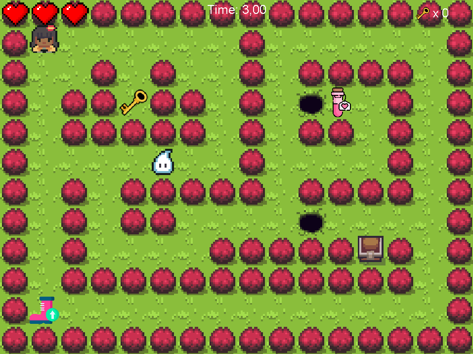

# MOSS Game

`MOSS Game` is a labyrinth game developed with Java.





## Installation
### Prerequisites
You need [Maven](https://maven.apache.org/) to run this game.

## How to play

```bash
mvn compile
mvn exec:java -Dexec.mainClass=start.Main
```

## Authors
This game started as a school project by [BEN RAIES Sabri](https://github.com/SabriBenRaies), [PHULPIN Suzy](https://github.com/suzyphulpin), [CARRETTE Orane](https://github.com/oranecarrette) and [FMARTINS Michelle](https://github.com/MichelleFMartins) 


